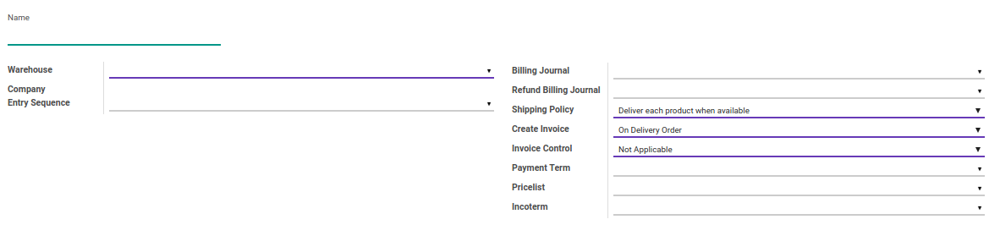
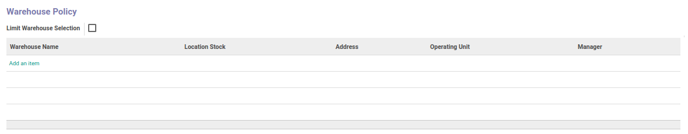
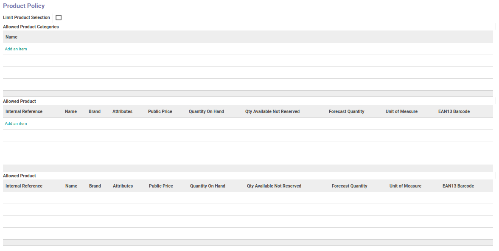
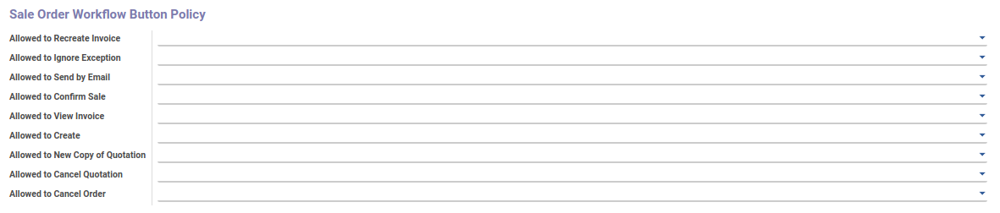
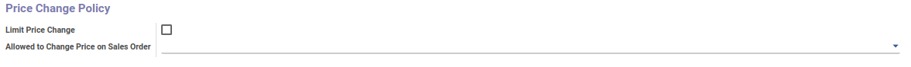

# Penjelasan Sales Order Type

Informasi pada Sales Order Type dibagi menjadi beberapa area, diantaranya:
* [Header](#bagian-header)
* [Warehouse Policy](#warehouse-policy)
* [Product Policy](#product-policy)
* [Sale Order Workflow Button Policy](#workflow-policy)
* [Price Change Policy](#price-change-policy)

## <a name="header">HEADER</a>

#### <a name="field-name">Name</a>

Nama tipe *Sales Order*

#### <a name="field-warehouse">Warehouse</a>

Mendefinisikan gudang

#### <a name="field-company">Company</a>

Mendefinisikan perusahaan

#### <a name="field-entry-sequence">Entry Sequence</a>

Mendefinisikan format *Sequence* untuk penomoran *Sales Order*

#### <a name="field-billing-journal">Billing Journal</a>

#TODO

#### <a name="field-refund-billing-journal">Refund Billing Journal</a>

#TODO

#### <a name="field-refund-billing-journal">Refund Billing Journal</a>

#TODO

#### <a name="field-shipping-policy">Shipping Policy</a>

Medefiniskan kebijakan pengiriman barang. Pilihan ini terbagi atas 2 pilihan, yaitu:
* **Deliver each product when available**
* **Deliver all product at once**

#### <a name="field-create-invoice">Create Invoice</a>

Medefiniskan pembuatan *Invoice*. Pilihan ini terbagi atas 3 pilihan, yaitu:
* **On Demand:** Invoice akan dibuat berdasarkan permintaan
* **On Delivery Order:** Invoice akan dibuat pada saat pengiriman
* **Before Delivery:** Invoice akan dibuat sebelum pengiriman

#### <a name="field-invoice-control">Invoice Control</a>

Medefiniskan pengontrolan invoice. Pilihan ini terbagi atas 3 pilihan, yaitu:
* **Invoiced**
* **To Be Invoiced**
* **Not Applicable**

#### <a name="field-payment-term">Payment Term</a>

Mendefinisikan ketentuan pembayaran

#### <a name="field-pricelist">Pricelist</a>

Mendefinisikan *Pricelist*

#### <a name="field-incoterm">Incoterm</a>
> **Catatan:** (Inggris: *International Commercial Terms* number disingkat Incoterm)

Mendefinisikan *Incoterm*

## <a name="warehouse-policy">WAREHOUSE POLICY</a>

#### <a name="field-limit-warehouse-selection">Limit Warehouse Selection</a>

Jika dicentang, maka pilihan gudang pada *Sales Order* akan dibatasi sesuai dengan warehouse yang sudah ditentukan pada list diatas

## <a name="product-policy">PRODUCT POLICY</a>

#### <a name="field-limit-product-selection">Limit Product Selection</a>

Jika dicentang, maka pilihan produk pada *Sales Order* akan dibatasi sesuai dengan produk yang sudah ditentukan pada list diatas

## <a name="workflow-policy">SALE ORDER WORKFLOW BUTTON POLICY</a>

#### <a name="field-allow-recreate-invoice">Allow to Recreate Invoice</a>

Mendefinisikan group yang memperbolehkan user untuk melakukan *Recreate Invoice* pada data *Sales Order*

#### <a name="field-allow-ignore-exception">Allow to Ignore Exception</a>

Mendefinisikan group yang memperbolehkan user untuk melakukan *Ignore Exception* pada data *Sales Order*

#### <a name="field-allow-send-by-email">Allow to Send by Email</a>

Mendefinisikan group yang memperbolehkan user untuk melakukan *Send By Email* pada data *Sales Order*

#### <a name="field-allow-can-confirm">Allow to Confirm Sale</a>

Mendefinisikan group yang memperbolehkan user untuk melakukan konfirmasi data *Sales Order*

#### <a name="field-allow-view-invoice">Allow to View Invoice</a>

Mendefinisikan group yang memperbolehkan user untuk melihat *Invoice* pada data *Sales Order*

#### <a name="field-allow-create-invoice">Allow to Create Invoice</a>

Mendefinisikan group yang memperbolehkan user untuk membuat *Invoice* pada data *Sales Order*

#### <a name="field-allow-new-copy-quotation">Allow to New Copy of Quotation</a>

Mendefinisikan group yang memperbolehkan user untuk menyalin data *Sales Order*

#### <a name="field-allow-cancel-order">Allow to Cancel Order</a>

Mendefinisikan group yang memperbolehkan user untuk membatalkan data *Sales Order*

## <a name="price-change-policy">PRICE CHANGE POLICY</a>

#### <a name="field-limit-price-change">Limit Price Change</a>

Jika dicentang, maka user yang dapat mengganti harga pada *Sales Order* akan dibatasi sesuai isian group **Allowed to Change Price on Sales Order**

#### <a name="field-allow-change-price">Allowed to Change Price on Sales Order</a>

Mendefinisikan group yang memperbolehkan user untuk mengganti harga pada data *Sales Order*