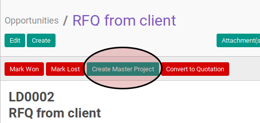
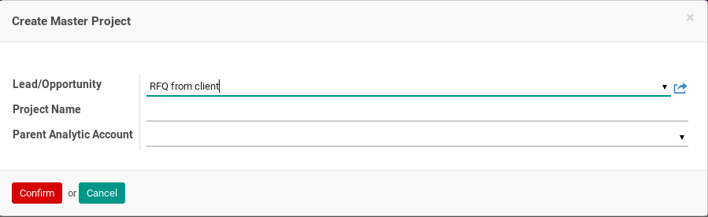
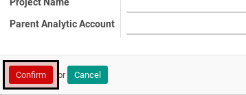

# Membuat Master Project Dari Opportunity

## A. INPUT

*(Tidak ada penjelasan khusus)*

## B. LANGKAH KERJA

1. Buka menu **Sales -> Sales -> Opportunites**. Abaikan jika sudah berada pada menu yang dimaksud.
2. Buka data yang akan dibuatkan master projectnya. Abaikan jika data sudah dibuka.
3. Klik tombol **Create Master Project** pada bagian atas-kiri form.

4. Pop-up **Create Master Project** akan muncul.

5. Isi **Project Name**.
6. Pilih **Parent Analytic Account**.
7. Klik tombol **Confirm** pada bagian bawah-kiri pop-up **Create Master Project**.

## C. OUTPUT

* Master project untuk opportunity akan terbuat
