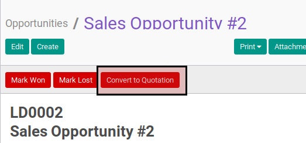
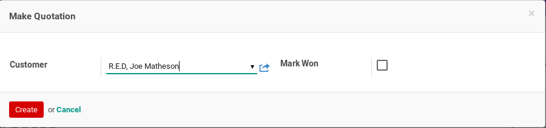
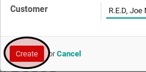

# Membuat Quotation Dari Opportunity

## A. INPUT

*(Tidak ada penjelasan khusus)*

## B. LANGKAH KERJA

1. Buka menu **Sales -> Sales -> Opportunites**. Abaikan jika sudah berada pada menu yang dimaksud.
2. Buka data yang akan dibuat quotationnya. Abaikan jika data sudah dibuka.
3. Klik tombol **Convert to Quotation** pada bagian atas-kiri form.

4. Pop-up **Make Quotation** akan muncul.

5. Isi dan sesuaikan **Customer** jika dibutuhkan. Harus diisi.
6. Klik tombol **Create** pada bagian bawah-kiri pop-up **Make Quotation**.

7. Data quotation baru akan terbuat dan terbuka.
8. Lanjutkan ke [langkah ke-3 instruksi kerja Memodifikasi Sales Order](../sales-order/modifikasi.md#l3).

## C. OUTPUT

* Data sale order terbuat dengan status **Draft**.
