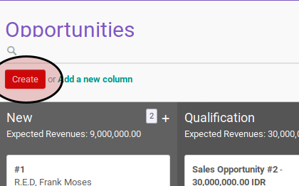
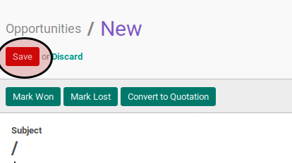

# Membuat Opportunity

## A. INPUT

*(Tidak ada penjelasan khusus)*

## B. LANGKAH KERJA

1. Buka menu **Sales -> Sales -> Opportunites**. Abaikan jika sudah berada pada menu yang dimaksud.
2. Klik tombol **Create** pada bagian atas-kiri form.

3. Isi **Subject**. Harus diisi.
4. Isi **Expected Revenue**. Harus diisi.
5. Pilih **Customer**. Harus diisi.
6. Isi dan sesuaikan **Email** jika dibutuhkan. Tidak harus diisi.
7. Isi dan sesuaikan **Phone** jika dibutuhkan. Tidak harus diisi.
8. Pilih **Salesperson**. Tidak harus diisi.
9. Pilih **Sales Team**. Tidak harus diisi.
10. Isi **Expected Closing**. Tidak harus diisi.
11. Pilih **Priority**. Tidak harus diisi.
12. Pilih **Tags**. Tidak harus diisi.
13. Buka tab **Internal Notes**.
14. Isi **Notes**. Tidak harus diisi.
15. Buka tab **Lead**.
16. Pilih **Campaign**. Tidak harus diisi.
17. Pilih **Channel**. Tidak harus diisi.
18. Pilih **Source**. Tidak harus diisi.
19. Pilih **Operating Unit**. Tidak harus diisi.
20. Klik tombol **Save** pada bagian atas-kiri form.

## C. OUTPUT

* Data opportunity akan terbuat.
