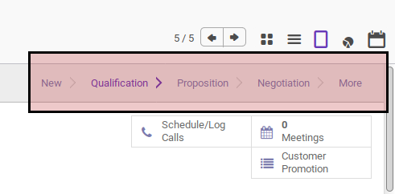

# Memindahkan Stage Opportunity

## A. INPUT

*(Tidak ada penjelasan khusus)*

## B. LANGKAH KERJA

1. Buka menu **Sales -> Sales -> Opportunites**. Abaikan jika sudah berada pada menu yang dimaksud.
2. Buka data yang akan diubah stagenya. Abaikan jika data sudah dibuka.
3. Klik stage yang diinginkan pada bagian atas-kanan form.

## C. OUTPUT

* Status dari opportunity akan berubah sesuai dengan stage yang dipilih.
