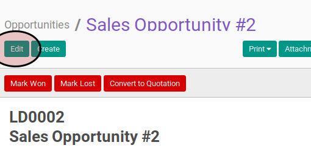

# Memodifikasi Opportunity

## A. INPUT

*(Tidak ada penjelasan khusus)*

## B. LANGKAH KERJA

1. Buka menu **Sales -> Sales -> Opportunites**. Abaikan jika sudah berada pada menu yang dimaksud.
2. Buka data yang akan dimodifikasi. Abaikan jika data sudah dibuka.
3. Klik tombol **Edit** pada bagian atas-kiri form.

4. Isi dan sesuaikan **Subject** jika dibutuhkan. Harus diisi.
5. Isi dan sesuaikan **Expected Revenue** jika dibutuhkan. Harus diisi.
6. Pilih dan sesuaikan **Customer** jika dibutuhkan. Harus diisi.
7. Isi dan sesuaikan **Email** jika dibutuhkan. Tidak harus diisi.
8. Isi dan sesuaikan **Phone** jika dibutuhkan. Tidak harus diisi.
9. Pilih dan sesuaikan **Salesperson** jika dibutuhkan. Tidak harus diisi.
10. Pilih dan sesuaikan **Sales Team** jika dibutuhkan. Tidak harus diisi.
11. Isi dan sesuaikan **Expected Closing** jika dibutuhkan. Tidak harus diisi.
12. Pilih dan sesuaikan **Priority** jika dibutuhkan. Tidak harus diisi.
13. Pilih dan sesuaikan **Tags** jika dibutuhkan. Tidak harus diisi.
14. Buka tab **Internal Notes**.
15. Isi dan sesuaikan **Notes** jika dibutuhkan. Tidak harus diisi.
16. Buka tab **Lead**.
17. Pilih dan sesuaikan **Campaign** jika dibutuhkan. Tidak harus diisi.
18. Pilih dan sesuaikan **Channel** jika dibutuhkan. Tidak harus diisi.
19. Pilih dan sesuaikan **Source** jika dibutuhkan. Tidak harus diisi.
20. Pilih dan sesuaikan **Operating Unit** jika dibutuhkan. Tidak harus diisi.
21. Klik tombol **Save** pada bagian atas-kiri form.

## C. OUTPUT

* Data opportunity akan berubah sesuai dengan perubahan yang dilakukan.
