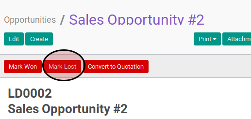
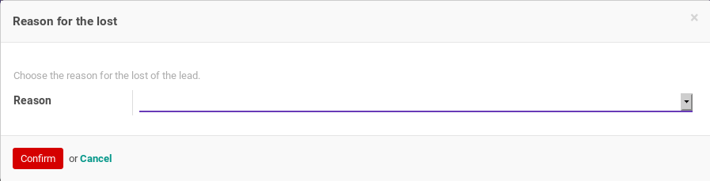
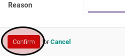

# Menandai Opportunity Sebagai Kalah

## A. INPUT

*(Tidak ada penjelasan khusus)*

## B. LANGKAH KERJA

1. Buka menu **Sales -> Sales -> Opportunites**. Abaikan jika sudah berada pada menu yang dimaksud.
2. Buka data yang akan dimodifikasi. Abaikan jika data sudah dibuka.
3. Klik tombol **Mark Lost** pada bagian atas-kiri form.

4. Pop-up **Reason for the Lost** akan muncul.

5. Pilih **Reason**. Harus diisi.
6. Klik tombol **Confirm** pada bagian atas-kiri pop-up **Reason for the Lost**.

## C. OUTPUT

*(Tidak ada penjelasan khusus)*
