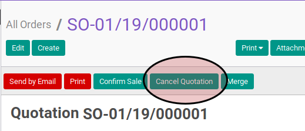

# Membatalkan Sales Order

## A. INPUT

* Data sales order yang akan dibatalkan harus memiliki status (1) **Draft Quotation**, atau (2) **Sales Order**, atau (3) **Sale To Invoice**

* User yang akan membatalkan harus memiliki akses untuk membatalkan sales order.

## B. LANGKAH KERJA

1. Buka menu **Sales -> Sales -> All Orders**. Abaikan jika sudah berada
pada menu yang dimaksud.
2. Buka data sales order yang akan dibatalkan. Abaikan jika data sudah dibuka.
3. Klik tombol **Cancel Quotation** atau **Cancel Order** pada bagian atas-kiri form.

Pop-up **Reason for Cancellation** akan muncul

4. Pilih **Reason** sesuai dengan alasan pembatalan
5. Klik tombol **Confirm** pada bagian bawah-kiri pop-up **Reason for Cancellation**

## C. OUTPUT

* Status dari sales order akan berubah menjadi **Cancelled**

* Isian sales order sudah tidak bisa diubah
