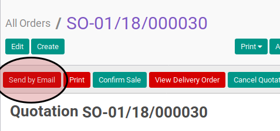
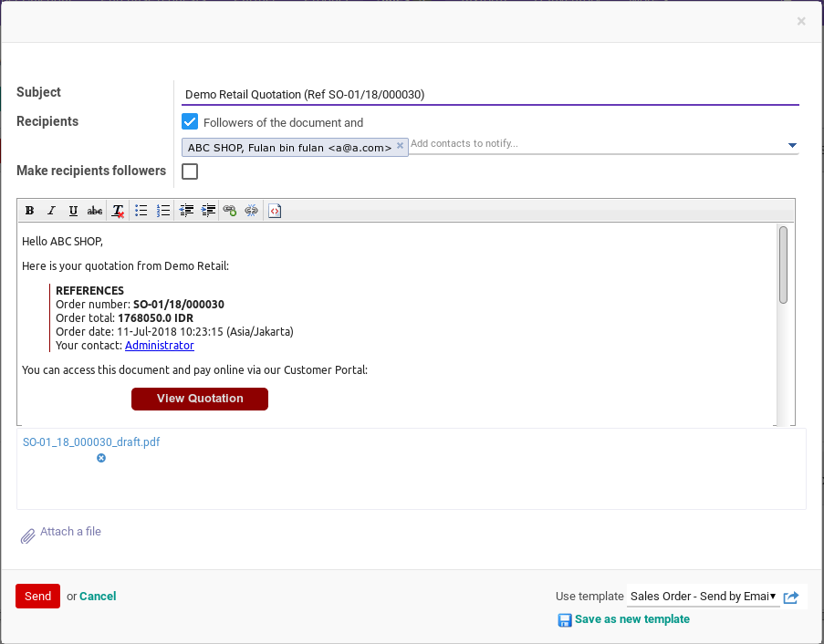
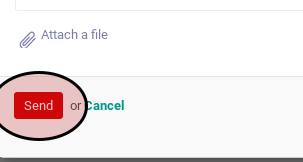
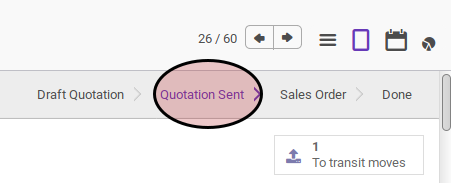

# Mengirimkan Sales Order Via Email

## A. INPUT

* Data sales order yang akan dikirim via email harus memiliki status **Draft Quotation**.

* User yang akan mengirim via email harus memiliki akses untuk mengirim via email sales order.

## B. LANGKAH KERJA

1. Buka menu **Sales -> Sales -> All Orders**. Abaikan jika sudah berada
pada menu yang dimaksud.
2. Buka data sales order yang akan dikirim via email. Abaikan jika data sudah dibuka.
3. Klik tombol **Send Quotation** pada bagian atas-kiri form.

Pop-up **Compose Email** akan muncul

4. Sesuaikan isi email jika dibutuhkan
5. Klik tombol **Send** pada bagian bawah-kiri pop-up **Compose Email**

## C. OUTPUT

* Status dari sales order akan berubah menjadi **Quotation Sent**

