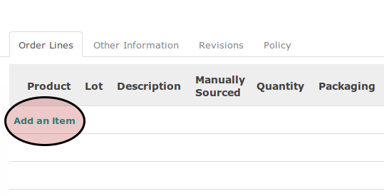
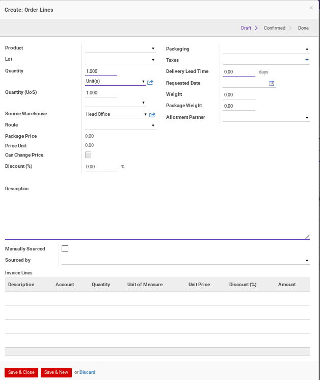
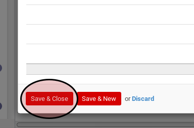
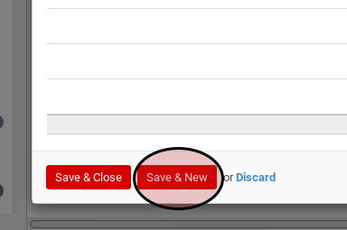

# Membuat Sales Order Line

1. Klik tombol **Add an Item** pada tabel **Order Lines**

Pop-up **Order Lines** akan muncul

2. <a name="l2">Pilih</a> **Product**. Harus diisi.
3. Pilih **Lot**. Tidak harus diisi.
4. Isi **Quantity**. Harus diisi.
5. Pilih **UoM**. Harus diisi.
6. Isi **Quantity (UoS)**. Tidak harus diisi.
7. Pilih **UoS**. Tidak harus diisi.
8. Pilih **Source Warehouse**. Tidak harus diisi.
9. Pilih **Route**. Tidak harus diisi.
10. Isi **Price Unit**.  Harus diisi.
11. Isi **Discount (%)**. Tidak harus diisi.
12. Pilih **Packaging**. Tidak harus diisi.
13. Pilih **Taxes**. Tidak harus diisi.
14. Isi **Delivery Lead Time**. Tidak harus diisi.
15. Isi **Request Date**. Tidak harus diisi.
16. Isi **Weight**. Tidak harus diisi.
17. Isi **Package Weight**. Tidak harus diisi.
18. Pilih **Allotment Partner**. Tidak harus diisi.
19. Isi **Description**. Harus diisi.
20. Aktifkan **Manually Sourced** jika dibutuhkan. Tidak harus diisi.
21. Pilih **Sourced by**. Tidak harus diisi.
22. Klik tombol **Save & Close** atau **Save & New** untuk menyimpan data. Ulangi [lngkah ke-2](#l2) apabila **Save & New** yang dipilih. Lanjutkan ke prosedur [Membuat Sales Order langkah ke-28](./membuat.md#l28) apabila **Save & Close** yang dipilih.

Tombol **Save & Close**

Tombol **Save & New**

