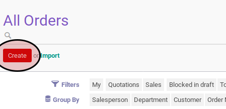
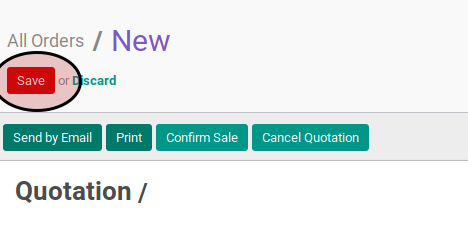
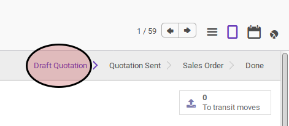

# Membuat Sales Order

## A. INPUT

## B. LANGKAH KERJA

1. Buka menu **Sales -> Sales -> All Orders**.
2. Klik tombol **Create** pada bagian atas-kanan form.

3. Pilih **Customer**. Harus diisi.
4. Pilih **Invoice Address**. Harus diisi.
5. Pilih **Consignee**. Tidak harus diisi.
6. Pilih **Delivery Address**. Harus diisi.
7. Pilih **Contract/Analytic**. Tidak harus diisi.
8. Isi **Date**. Harus diisi.
9. Isi **Vali Until**. Tidak harus diisi.
10. Isi **Reference/Description**. Tidak harus diisi.
11. Pilih **Type**. Harus diisi.
12. Pilih **Default Warehouse**. Harus diisi.
13. Pilih **Pricelist**. Harus diisi.
14. Buka tab **Other Information**.
15. Pilih **Incoterm**. Tidak harus diisi.
16. Pilih **Salesperson**. Tidak harus diisi.
17. Pilih **Tag**. Tidak harus diisi.
18. Pilih **Operating Unit**. Harus diisi.
19. Pilih **Sales Team** Tidak harus diisi.
20. Isi **Source Document**. Tidak harus diisi.
21. Pilih **Campaign**. Tidak harus diisi.
22. Pilih **Channel**. Tidak harus diisi.
23. Pilih **Source**. Tidak harus diisi.
24. Pilih **Payment Term**. Tidak harus diisi.
25. Isi **Requested Date**. Tidak harus diisi.
26. Buka tab **Order Lines**.
27. Untuk setiap produk yang dijual lakukan prosedur [Pembuatan Order Line](./membuat-line.md).
28. <a name="l28">Klik</a> tombol **Save** pada bagian atas-kiri form.

## C. OUTPUT

* Sales order akan tersimpan dengan status **Draft Quotation**

