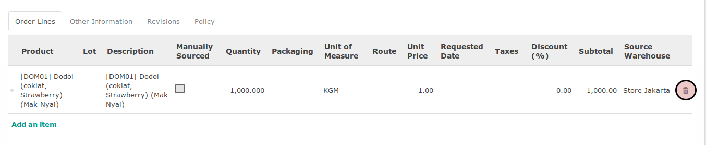

# Menghapus Sales Order Line

*(Instruksi kerja ini merupakan sub instruksi dari (1) [Membuat Sale Order](./membuat.md), atau (2) [Memodifikasi Sale Order](./modifikasi.md). Instruksi kerja ini tidak bisa berdiri sendiri)*

## A. INPUT

*(Tidak ada instruksi khusus)*

## B. INSTRUKSI KERJA

1. Klik icon tempat sampah pada bagian kanan order line yang akan dihapus.

## C. OUTPUT

* Order line akan terhapus.
