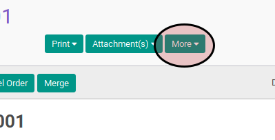
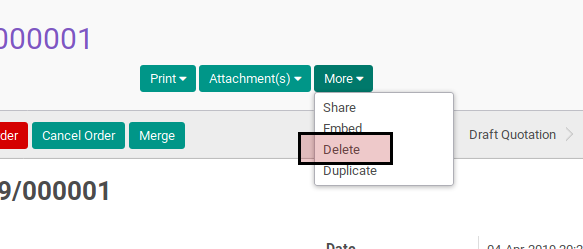
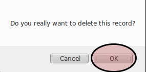

# Menghapus Sales Order

## A. INPUT

* Data sales order yang akan dihapus harus memiliki status **Draft Quotation**.

## B. LANGKAH KERJA

1. Buka menu **Sales -> Sales -> All Orders**. Abaikan jika sudah berada pada menu yang dimaksud.
2. Buka data sales order yang akan dihapus. Abaikan jika data sudah dibuka.
3. Klik tombol **More** pada bagian atas-kanan form.

4. Klik tombol **Delete** pada drop-down yang muncul dari tombol **More**.

5. Klik tombol **Ok** pada dialog konfirmasi penghapusan.

## C. OUTPUT

* Data sale order akan terhapus.
