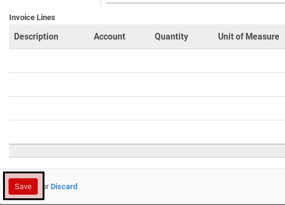

# Memodifikasi Sales Order Line

*(Instruksi kerja ini merupakan sub instruksi dari (1) [Membuat Sale Order](./membuat.md), atau (2) [Memodifikasi Sale Order](./modifikasi.md). Instruksi kerja ini tidak bisa berdiri sendiri)*

## A. INPUT

*(Tidak ada instruksi khusus)*

## B. INSTRUKSI KERJA

1. <a name="l1">Buka</a> data **Order Line** yang akan dimodifikasi.

Pop-up **Order Lines** akan muncul

2. <a name="l2">Pilih</a> dan sesuaikan **Product** jika dibutuhkan. Harus diisi.
3. Pilih dan sesuaikan **Lot** jika dibutuhkan. Tidak harus diisi.
4. Isi dan sesuaikan **Quantity** jika dibutuhkan. Harus diisi.
5. Pilih dan sesuaikan **UoM** jika dibutuhkan. Harus diisi.
6. Isi dan sesuaikan **Quantity (UoS)** jika dibutuhkan. Tidak harus diisi.
7. Pilih dan sesuaikan **UoS** jika dibutuhkan. Tidak harus diisi.
8. Pilih dan sesuaikan **Source Warehouse** jika dibutuhkan. Tidak harus diisi.
9. Pilih dan sesuaikan **Route** jika dibutuhkan. Tidak harus diisi.
10. Isi dan sesuaikan **Price Unit** jika dibutuhkan.  Harus diisi.
11. Isi dan sesuaikan **Discount (%)** jika dibutuhkan. Tidak harus diisi.
12. Pilih dan sesuaikan **Packaging** jika dibutuhkan. Tidak harus diisi.
13. Pilih dan sesuaikan **Taxes** jika dibutuhkan. Tidak harus diisi.
14. Isi dan sesuaikan **Delivery Lead Time** jika dibutuhkan. Tidak harus diisi.
15. Isi dan sesuaikan **Request Date** jika dibutuhkan. Tidak harus diisi.
16. Isi dan sesuaikan **Weight** jika dibutuhkan. Tidak harus diisi.
17. Isi dan sesuaikan **Package Weight** jika dibutuhkan. Tidak harus diisi.
18. Pilih dan sesuaikan **Allotment Partner** jika dibutuhkan. Tidak harus diisi.
19. Isi dan sesuaikan **Description** jika dibutuhkan. Harus diisi.
20. Aktifkan **Manually Sourced** jika dibutuhkan. Tidak harus diisi.
21. Pilih dan sesuaikan **Sourced by** jika dibutuhkan. Tidak harus diisi.
22. Klik tombol **Save**. Lanjutkan ke [langkah ke-27 instruksi kerja Membuat Sales Order](./membuat.md#l27) atau [langkah ke-28 instruksi kerja Memodifikasi Sales Order](./modifikasi.md#l28).

