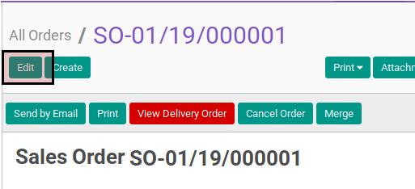

# Memodifikasi Sales Order

## A. INPUT

* Data sales order yang akan dimodifikasi harus memiliki status **Draft Quotation**.

## B. LANGKAH KERJA

1. Buka menu **Sales -> Sales -> All Orders**. Abaikan jika sudah berada pada menu yang dimaksud.
2. Buka data sales order yang akan dimodifikasi. Abaikan jika data sudah dibuka.
3. <a name="l3">Klik</a> tombol **Edit** pada bagian atas-kanan form.

4. Pilih dan sesuaikan **[Customer](./penjelasan.md#field-customer)** jika dibutuhkan. Harus diisi.
5. Pilih dan sesuaikan **[Invoice Address](./penjelasan.md#field-customer)** jika dibutuhkan. Harus diisi.
6. Pilih dan sesuaikan **[Consignee](./penjelasan.md#field-consginee)** jika dibutuhkan. Tidak harus diisi.
7. Pilih dan sesuaikan **[Delivery Address](./penjelasan.md#field-delivery)** jika dibutuhkan. Harus diisi.
8. Pilih dan sesuaikan **[Contract/Analytic](./penjelasan.md#field-analytic)** jika dibutuhkan. Tidak harus diisi.
9. Isi dan sesuaikan **[Date](./penjelasan.md#field-date)** jika dibutuhkan. Harus diisi.
10. Isi dan sesuaikan **[Valid Until](./penjelasan.md#field-valid)** jika dibutuhkan. Tidak harus diisi.
11. Isi dan sesuaikan **[Reference/Description](./penjelasan.md#field-ref-desc)** jika dibutuhkan. Tidak harus diisi.
12. Pilih dan sesuaikan **[Type](./penjelasan.md#field-type)** jika dibutuhkan. Harus diisi.
13. Pilih dan sesuaikan **[Default Warehouse](./penjelasan.md#field-warehouse)** jika dibutuhkan. Harus diisi.
14. Pilih dan sesuaikan **[Pricelist](./penjelasan.md#field-pricelist)** jika dibutuhkan. Harus diisi.
15. Buka tab **Other Information**.
16. Pilih dan sesuaikan **[Incoterm](./penjelasan.md#field-incoterm)** jika dibutuhkan. Tidak harus diisi.
17. Pilih dan sesuaikan **[Salesperson](./penjelasan.md#field-salesperson)** jika dibutuhkan. Tidak harus diisi.
18. Pilih dan sesuaikan **[Tags](./penjelasan.md#field-tags)** jika dibutuhkan. Tidak harus diisi.
19. Pilih dan sesuaikan **[Operating Unit](./penjelasan.md#field-operating-unit)** jika dibutuhkan. Harus diisi.
20. Pilih dan sesuaikan **[Sales Team](./penjelasan.md#field-sales-team)**  jika dibutuhkan. Tidak harus diisi.
21. Isi dan sesuaikan **[Source Document](./penjelasan.md#field-source-document)** jika dibutuhkan. Tidak harus diisi.
22. Pilih dan sesuaikan **[Campaign](./penjelasan.md#field-campaign)** jika dibutuhkan. Tidak harus diisi.
23. Pilih dan sesuaikan **[Channel](./penjelasan.md#field-channel)** jika dibutuhkan. Tidak harus diisi.
24. Pilih dan sesuaikan **[Source](./penjelasan.md#field-source)** jika dibutuhkan. Tidak harus diisi.
25. Pilih dan sesuaikan **[Payment Term](./penjelasan.md#field-payment-term)** jika dibutuhkan. Tidak harus diisi.
26. Isi dan sesuaikan **[Requested Date](./penjelasan.md#field-requested-date)** jika dibutuhkan. Tidak harus diisi.
27. Buka tab **Order Lines**.
28. <a name="l28">[Tambah](./membuat-line.md)/[Modifikasi](./modifikasi-line.md)/[Hapus](./meghapus-line.md) **Order Lines**</a>. Ulangi sampai **Order Lines** sesuai dengan keingnan.
29. <a name="l29">Klik</a> tombol **Save** pada bagian atas-kiri form.

## C. OUTPUT

* Sales order berubah sesuai dengan perubahan yang dilakukan.
