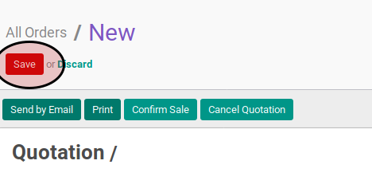

# Memodifikasi Sales Order

## A. INPUT

* Data sales order yang akan dimodifikasi harus memiliki status **Draft Quotation**.

## B. LANGKAH KERJA

1. Buka menu **Sales -> Sales -> All Orders**. Abaikan jika sudah berada pada menu yang dimaksud.
2. Buka data sales order yang akan dimodifikasi. Abaikan jika data sudah dibuka.
3. <a name="l3">Klik</a> tombol **Edit** pada bagian atas-kanan form.

4. Pilih dan sesuaikan **Customer** jika dibutuhkan. Harus diisi.
5. Pilih dan sesuaikan **Invoice Address** jika dibutuhkan. Harus diisi.
6. Pilih dan sesuaikan **Consignee** jika dibutuhkan. Tidak harus diisi.
7. Pilih dan sesuaikan **Delivery Address** jika dibutuhkan. Harus diisi.
8. Pilih dan sesuaikan **Contract/Analytic** jika dibutuhkan. Tidak harus diisi.
9. Isi dan sesuaikan **Date** jika dibutuhkan. Harus diisi.
10. Isi dan sesuaikan **Valid Until** jika dibutuhkan. Tidak harus diisi.
11. Isi dan sesuaikan **Reference/Description** jika dibutuhkan. Tidak harus diisi.
12. Pilih dan sesuaikan **Type** jika dibutuhkan. Harus diisi.
13. Pilih dan sesuaikan **Default Warehouse** jika dibutuhkan. Harus diisi.
14. Pilih dan sesuaikan **Pricelist** jika dibutuhkan. Harus diisi.
15. Buka tab **Other Information**.
16. Pilih dan sesuaikan **Incoterm** jika dibutuhkan. Tidak harus diisi.
17. Pilih dan sesuaikan **Salesperson** jika dibutuhkan. Tidak harus diisi.
18. Pilih dan sesuaikan **Tag** jika dibutuhkan. Tidak harus diisi.
19. Pilih dan sesuaikan **Operating Unit** jika dibutuhkan. Harus diisi.
20. Pilih dan sesuaikan **Sales Team**  jika dibutuhkan. Tidak harus diisi.
21. Isi dan sesuaikan **Source Document** jika dibutuhkan. Tidak harus diisi.
22. Pilih dan sesuaikan **Campaign** jika dibutuhkan. Tidak harus diisi.
23. Pilih dan sesuaikan **Channel** jika dibutuhkan. Tidak harus diisi.
24. Pilih dan sesuaikan **Source** jika dibutuhkan. Tidak harus diisi.
25. Pilih dan sesuaikan **Payment Term** jika dibutuhkan. Tidak harus diisi.
26. Isi dan sesuaikan **Requested Date** jika dibutuhkan. Tidak harus diisi.
27. Buka tab **Order Lines**.
28. <a name="l28">[Tambah](./membuat-line.md)/[Modifikasi](./modifikasi-line.md)/[Hapus](./meghapus-line.md) **Order Lines**</a>. Ulangi sampai **Order Lines** sesuai dengan keingnan.
29. <a name="l29">Klik</a> tombol **Save** pada bagian atas-kiri form.

## C. OUTPUT

* Sales order berubah sesuai dengan perubahan yang dilakukan.
