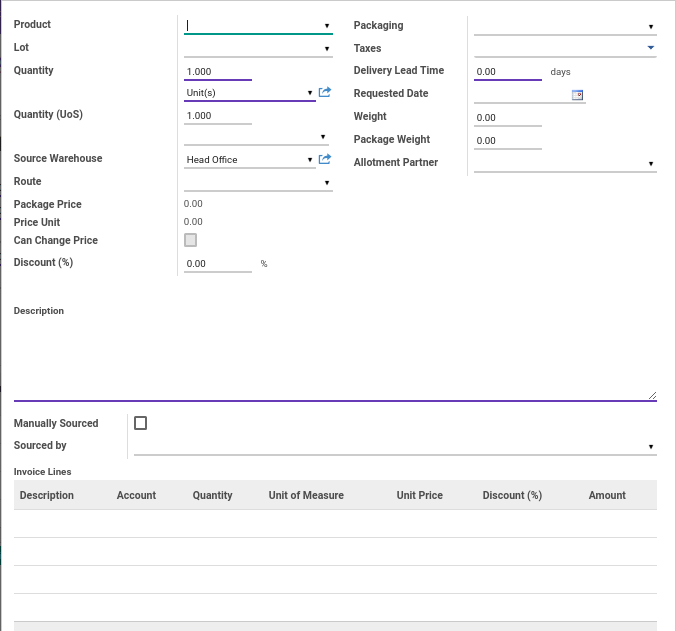

# Penjelasan Detail Order Lines

## <a name="penjelasan-detail">Detail Order Lines</a>

#### <a name="field-product">Product</a>

Mendefinisikan produk

#### <a name="field-lot">Lot</a>

Mendefinisikan Lot

#### <a name="field-quantity">Quantity</a>

Menentukan jumlah barang dan satuan yang akan dipesan

#### <a name="field-quantity-Uos">Quantity(UoS)</a>

Menentukan jumlah barang dan satuan kedua yang akan dipesan

#### <a name="field-source-warehouse">Source Warehouse</a>

Mendefinisikan gudang yang akan mengeluarkan barang

#### <a name="field-route">Route</a>

Mendefinisikan rute pengiriman barang

#### <a name="field-packaging">Packaging</a>

Mendefinisikan kemasan produk

#### <a name="field-taxes">Taxes</a>

Mendefinisikan pajak yang akan dikenakan pada produk

#### <a name="field-deliv-lead-time">Delivery Lead Time</a>

Mendefinisikan waktu pengiriman barang

#### <a name="field-request-date">Requested Date</a>

Mendefinisikan tanggal permintaan barang

#### <a name="field-weight">Weight</a>

Menentukan berat dari produk

#### <a name="field-package-weight">Package Weight</a>

Menentukan berat dari kemasan produk

#### <a name="field-allotment-partner">Allotment Partner</a>

#TODO

#### <a name="field-package-price">Package Price</a>

Menginformasikan harga kemasan

#### <a name="field-unit-price">Unit Price</a>

Menginformasikan harga satuan produk

#### <a name="field-can-change-price">Can Change Price</a>

Disii otomatis oleh Odoo. Jika aktif, maka user yang membuka data dapat melakukan perubahan harga produk

#### <a name="field-discount">Discount(%)</a>

Mendefinisikan persentase diskon yang akan diberikan

#### <a name="field-description-produk">Description</a>

Mendefinisikan deskripsi produk

#### <a name="field-manually-sourced">Manually Sourced</a>

#TODO

#### <a name="field-sourced-by">Sourced By</a>

#TODO

#### <a name="field-invoice-lines">Invoice Lines</a>

#TODO