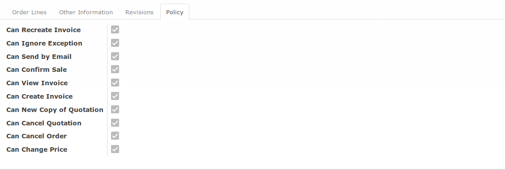

# Penjelasan

* [Header](#header)
* [Tab Order Lines](#tab-order-lines)
* [Tab Other Information](#tab-other-information)
* [Tab Revision](#tab-revision)
* [Tab Policy](#tab-policy)

## <a name="header">A. HEADER</a>

## <a name="tab-order-lines">B. TAB ORDER LINES</a>

### <a name="tabel-order-lines">B.1. TABEL ORDER LINES</a>

## <a name="tab-other-information">C. TAB OTHER INFORMATION</a>

## <a name="tab-revision">D. TAB REVISION</a>

## <a name="tab-policy">E. TAB POLICY</a>

