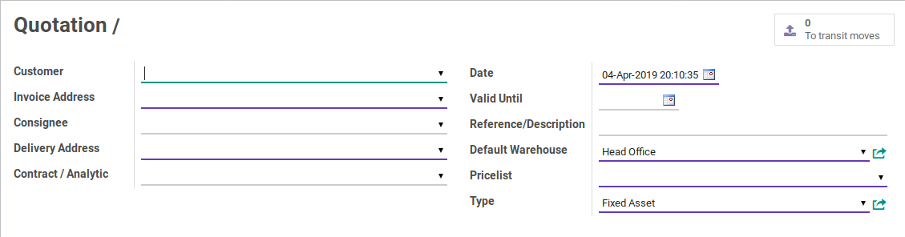
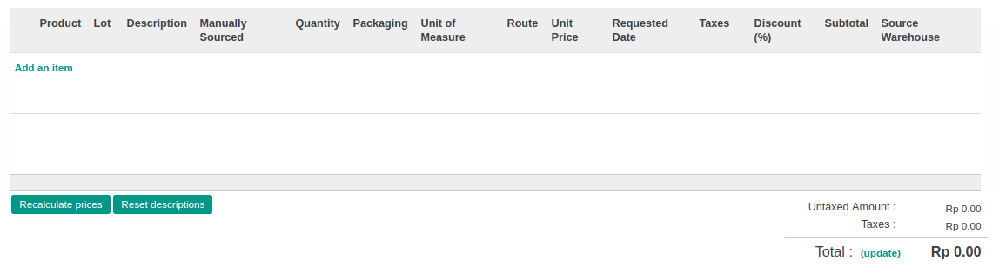

# Penjelasan

* [Header](#header)
* [Tab Order Lines](#tab-order-lines)
* [Tab Other Information](#tab-other-information)
* [Tab Revision](#tab-revision)
* [Tab Policy](#tab-policy)

## <a name="header">HEADER</a>

#### <a name="field-number"># Order(*Quotation /*)</a>

Mendefinisikan nomor *Sales Order*. Penomoran akan diisi otomatis oleh odoo ketika data disimpan

#### <a name="field-customer">Customer</a>

Mendefinisikan konsumen

#### <a name="field-invoice-address">Invoice Address</a>

Mendefinisikan alamat konsumen yang akan dijadikan sebagai tujuan pengiriman *Invoice*

#### <a name="field-consignee">Consignee</a>

Mendefinisikan orang yang akan menerima barang

#### <a name="field-delivery-address">Delivery Address</a>

Mendefinisikan alamat konsumen yang akan dijadikan sebagai tujuan pengiriman barang

#### <a name="field-analytic">Contract / Analytic</a>

Mendefinisikan kontrak atau akun analitik terkait *Sales Order*

#### <a name="field-date">Date</a>

Mendefinisikan tanggal *Sales Order*

#### <a name="field-valid">Valid Until</a>

Mendefinisikan tanggal masa berlaku habisnya *Sales Order*

#### <a name="field-ref-desc">Reference/Description</a>

Nomor referensi atau deskripsi terkait *Sales Order*

#### <a name="field-warehouse">Default Warehouse</a>

Mendefinisikan gudang yang akan mengeluarkan barang

#### <a name="field-pricelist">Pricelist</a>

Mendefinisikan *Pricelist*

#### <a name="field-type">Type</a>

Mendefinisikan tipe *Sales Order*

## <a name="tab-order-lines">TAB ORDER LINES</a>

Penjelasan lengkap mengenai detail *Order Lines* diatas dapat dilihat pada dokumentasi **[Penjelasan Detail Order Lines](./penjelasan-detail-order-lines.md)**

#### <a name="field-delivery-method">Delivery Method</a>

Metode pengiriman yang akan digunakan

#### <a name="field-term-condition">Terms and conditions</a>

Mendefinisikan syarat dan ketentuan yang berlaku terkait *Sales Order*

## <a name="tab-other-information">TAB OTHER INFORMATION</a>

#### <a name="field-incoterm">Incoterm</a>
> **Catatan:** (Inggris: *International Commercial Terms* number disingkat Incoterm)

Mendefinisikan *Incoterm* terkait *Sales Order*

#### <a name="field-shipping-policy">Shipping Policy</a>

Medefiniskan kebijakan pengiriman barang. Pilihan ini terbagi atas 2 pilihan, yaitu:  
* **Deliver each product when available**
* **Deliver all product at once**

#### <a name="field-create-invoice">Create Invoice</a>

Medefiniskan pembuatan *Invoice*. Pilihan ini terbagi atas 3 pilihan, yaitu:  
* **On Demand:** Invoice akan dibuat berdasarkan permintaan
* **On Delivery Order:** Invoice akan dibuat pada saat pengiriman
* **Before Delivery:** Invoice akan dibuat sebelum pengiriman

#### <a name="field-salesperson">Salesperson</a>

Mendefinisikan *Sales Person*

#### <a name="field-tags">Tags</a>

#TODO

#### <a name="field-operating-unit">Operating Unit</a>
> **Catatan:** Isian ini hanya untuk user yang memiliki group **Multi Operating Unit**

Mendefinisikan operating unit untuk *Sales Order*.

#### <a name="field-sales-team">Sales Team</a>

Mendefinisikan *Sales Team*

#### <a name="field-source-document">Source Document</a>

Mendefinisikan dokumen terkait *Sales Order*

#### <a name="field-campaign">Campaign</a>

#TODO

#### <a name="field-channel">Channel</a>

#TODO

#### <a name="field-source">Source</a>

#TODO

#### <a name="field-payment-term">Payment Term</a>

Mendefinisikan ketentuan pembayaran

#### <a name="field-fiscal-position">Fiscal Position</a>

#TODO

#### <a name="field-invoice-amount">Invoice Amount</a>

Menginformasikan total harga *Invoice*

#### <a name="field-invoice-pending-amount">Invoice Pending Amount</a>

Menginformasikan total harga *Invoice* yang tertunda

#### <a name="field-company">Company</a>

Mendefinisikan perusahaan

#### <a name="field-requested-date-other">Requested Date</a>

Mendefinisikan tanggal permintaan *Sales Order*

#### <a name="field-commitment-date-other">Commitment Date</a>

Mendefinisikan tanggal komitmen *Sales Order*

#### <a name="field-efective-date-other">Efective Date</a>

Mendefinisikan tanggal efektif *Sales Order*

#### <a name="field-paid">Paid</a>

Menginformasikan status pembayaran *Sales Order*. Jika dicentang, maka *Sales Order* sudah dibayar lunas

#### <a name="field-delivered">Delivered</a>

Menginformasikan status pengiriman *Sales Order*. Jika dicentang, maka produk sudah dikirim dan diterima oleh konsumen

#### <a name="field-exception">Exception</a>

#TODO

## <a name="tab-revision">TAB REVISION</a>

#### <a name="field-revisions">Revisions</a>

#TODO

## <a name="tab-policy">TAB POLICY</a>

#### <a name="field-can-recreate-invoice">Can Recreate Invoice</a>

Diisi otomatis oleh Odoo. Jika aktif, maka user yang membuka data *Sales Order* dapat membuat ulang invoice

#### <a name="field-can-ignore-exception">Can Ignore Exception</a>

#TODO

#### <a name="field-can-send-by-email">Can Send by Email</a>

Diisi otomatis oleh Odoo. Jika aktif, maka user yang membuka data *Sales Order* dapat megirim dokumen *Sales Order* melalui email

#### <a name="field-change-can-confirm">Can Confirm Sale</a>

Diisi otomatis oleh Odoo. Jika aktif, maka user yang membuka data *Sales Order* dapat melakukan [Mengkonfirmasi Sales Order](./konfirmasi.md).

#### <a name="field-can-view-invoice">Can View Invoice</a>

Diisi otomatis oleh Odoo. Jika aktif, maka user yang membuka data *Sales Order* dapat melihat *Invoice*

#### <a name="field-can-create-invoice">Can Create Invoice</a>

Diisi otomatis oleh Odoo. Jika aktif, maka user yang membuka data *Sales Order* dapat membuat invoice

#### <a name="field-can-new-copy-quotation">Can New Copy of Quotation</a>

Diisi otomatis oleh Odoo. Jika aktif, maka user yang menyalin ulang data *Sales Order*

#### <a name="field-cancel-order">Can Cancel Order</a>

Diisi otomatis oleh Odoo. Jika aktif, maka user yang membuka data *Sales Order* dapat melakukan [Membatalkan Sales Order](./batal.md)

#### <a name="field-can-change-price">Can Change Price</a>

Diisi otomatis oleh Odoo. Jika aktif, maka user yang membuka data *Sales Order* dapat mengganti harga