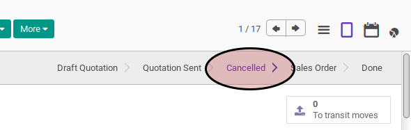
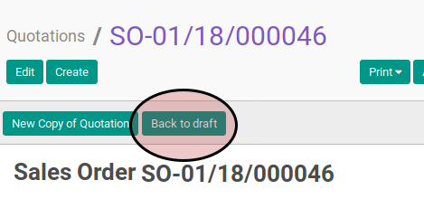

# Merestart Sales Order

## A. INPUT

* Data sales order yang akan direstart harus memiliki status **Cancelled**.

* User yang akan merestart harus memiliki akses untuk merestart sales order.

## B. LANGKAH KERJA

1. Buka menu **Sales -> Sales -> All Orders**. Abaikan jika sudah berada
pada menu yang dimaksud.
2. Buka data sales order yang akan direstart. Abaikan jika data sudah dibuka.
3. Klik tombol **Back to Draft** pada bagian atas-kiri form.

## C. OUTPUT

* Status dari sales order akan berubah menjadi **Draft Quotation**

* Isian sales order sudah dapat diubah
